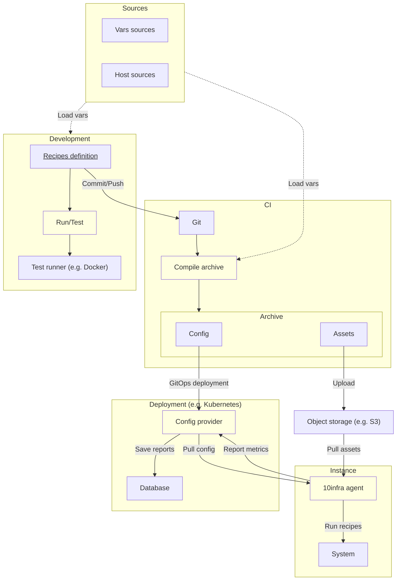

# Architecture

`10infra-config` is a pull-based task execution system, which works in 3 phases:

1. **Local development**: users create [recipes](./recipes.md) and [test](./testing.md) them, assigning to each recipe the [hosts](./inventory.md) it is supposed to run on.
2. **Compilation**: recipes are packed together and "compiled" e.g. through a CI process, creating a finished package of [assets] that can be released.
3. **Runtime**: a central distributor (the [config provider]) offers the archive to the various [agents], who are installed on every destination machine.

## Chart

Below is a chart that represents the high-level architecture of the development/deployment flow of a 10infra-config
archive.

Note: the yellow blocks are all 10infra executables.

